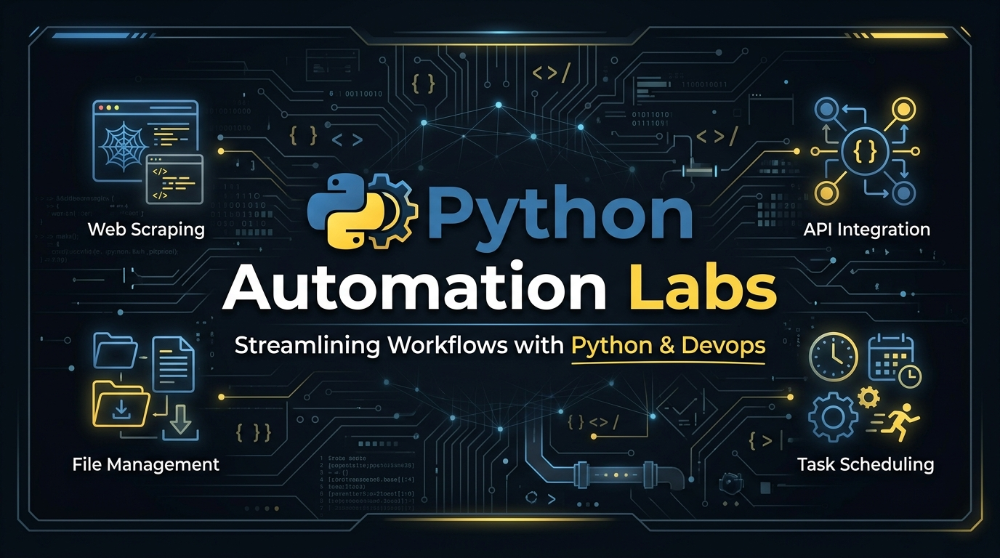

# 🐍⚙️ Python Automation Labs



Hands-on Python automation labs covering real-world scripting, file management, web scraping, API integration, task scheduling, and DevOps workflow automation.

---

## 📁 Labs Directory

| Lab # | Lab Title | Core Concepts Covered | Status |
|---|---|---|---|
| Lab 01 | *File & Directory Automation* | `os`, `shutil`, `pathlib`, Bulk File Ops | 🔜 |
| Lab 02 | *Web Scraping & Data Extraction* | `requests`, `BeautifulSoup`, CSV Export | 🔜 |
| Lab 03 | *API Integration & JSON Handling* | REST APIs, Webhooks, Data Formatting | 🔜 |
| Lab 04 | *Automated Task Scheduling* | `schedule`, `cron`, System Automation | 🔜 |

---

## 🛠 Tech Stack & Prerequisites

| Tool | Details |
|---|---|
| **OS** | Ubuntu / Debian / WSL2 / Windows |
| **Language** | Python 3.10+ |
| **Environment** | Virtualenv (`venv`), pip |
| **Libraries** | `os`, `shutil`, `requests`, `beautifulsoup4`, `schedule`, `smtplib` |
| **CLI** | `python3`, `bash`, `cron` |

---

## 🚀 Topics Covered

- 📂 **File & Directory Automation** — Bulk rename, sorting, archive backups
- 🌐 **Web Scraping** — HTML parsing, data scraping, automated data pipelines
- 🔗 **API Integration** — REST APIs, authentication, payload parsing
- ⏰ **Task Scheduling** — Background jobs, cron integration, notification triggers
- 📧 **Alerts & Notifications** — Automated email alerts and status webhooks
- 🛠 **DevOps Automation** — Server health checks, log monitoring, deployment scripts

---

## 📌 Setup & Quick Start

```bash
# Clone the repository
git clone https://github.com/Danish20699/python-automation.git
cd python-automation

# Create and activate virtual environment
python3 -m venv venv
source venv/bin/activate    # Linux / macOS
# or
venv\Scripts\activate       # Windows

# Install dependencies
pip install -r requirements.txt
```

---

## 👤 Author

**Danish Nazir**
- GitHub: [@Danish20699](https://github.com/Danish20699)